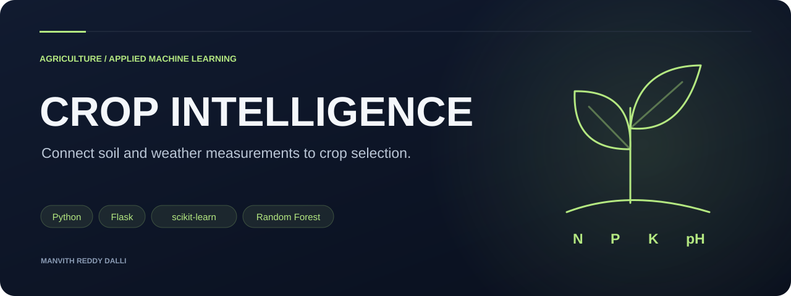
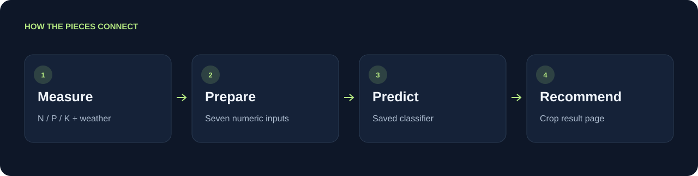

<p align="center"></p>

<h1 align="center">ML Crop Recommendation</h1>

<p align="center">Connect soil and weather measurements to crop selection.</p>

<p align="center"><code>Python</code> &nbsp; <code>Flask</code> &nbsp; <code>scikit-learn</code> &nbsp; <code>Random Forest</code></p>

<p align="center"><a href="#prediction-workflow">Prediction workflow</a> · <a href="#inputs">Inputs</a> · <a href="#technology">Technology</a> · <a href="#project-materials">Project materials</a> · <a href="#local-setup">Local setup</a></p>

<table><tr><td width="33%" valign="top"><h3>Seven input features</h3><p>Nutrients, pH, temperature, humidity, and rainfall.</p></td><td width="33%" valign="top"><h3>Model exploration</h3><p>A notebook compares multiple classification approaches.</p></td><td width="33%" valign="top"><h3>Research connection</h3><p>Application work supported by a paper and certificate.</p></td></tr></table>

---

A Flask application that accepts seven agricultural measurements and uses a trained classifier to recommend a crop. The accompanying notebook explores multiple machine-learning models; Random Forest was selected for the application.


## Prediction workflow



## Inputs

| Measurement | Meaning |
| --- | --- |
| Nitrogen, phosphorus, potassium | Soil nutrient measurements |
| Temperature | Environmental temperature |
| Humidity | Relative humidity |
| pH | Soil acidity / alkalinity |
| Rainfall | Precipitation measurement |

Use the same units and feature order as the training dataset. Recommendations are model outputs from the project dataset and require agronomic judgment before real-world use.

## Technology

Python · Flask · scikit-learn · Pandas · NumPy · HTML/CSS. Model exploration includes Logistic Regression, Decision Trees, Random Forest, and XGBoost.

## Project materials

- [`crop_ml.ipynb`](crop_ml.ipynb): training and model exploration.
- [`main.py`](main.py): Flask routes and prediction flow.
- [`templates/`](templates/): input and crop-specific result pages.
- [`docs/crop_recommendation_paper.pdf`](docs/crop_recommendation_paper.pdf): related paper co-authored for the Indian Journal of Natural Sciences, 2023.
- [`docs/crop_recommendation_certificate.pdf`](docs/crop_recommendation_certificate.pdf): publication certificate.

## Local setup

```sh
git clone https://github.com/Manvith-d/ml-crop-recommendation.git
cd ml-crop-recommendation
python -m venv .venv
source .venv/bin/activate
pip install -r requirements.txt
```

Before starting, replace the original machine-specific CSV path in `main.py` with the local `Crop_recommendation (1).csv` path. Then run:

```sh
python main.py
```

Open the address printed by Flask. The checked-in pickle model and preprocessing came from the original training environment; compatible dependencies and consistent preprocessing are required. The legacy preprocessing should be consolidated into a saved scikit-learn pipeline before treating this as a production service.

---
Explore more work in [Manvith Reddy Dalli’s portfolio](https://manvith-d.github.io/portfolio/) · [LinkedIn](https://www.linkedin.com/in/manvith-reddy-dalli-38a06a257)
